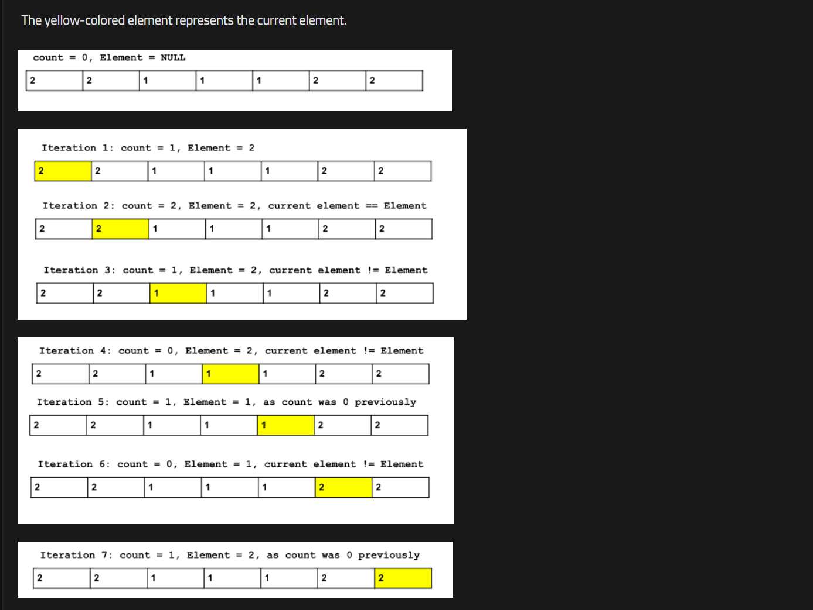

# Moore Majority Voting Algorithm:

> link: https://takeuforward.org/data-structure/find-the-majority-element-that-occurs-more-than-n-2-times/

> Problem link: https://leetcode.com/problems/majority-element/description/

## Intution:

If the array contains a majority element, its occurrence must be greater than the floor(N/2). Now, we can say that the count of minority elements and majority elements is equal up to a certain point in the array. So when we traverse through the array we try to keep track of the count of elements and the element itself for which we are tracking the count.

After traversing the whole array, we will check the element stored in the variable. If the question states that the array must contain a majority element, the stored element will be that one but if the question does not state so, then we need to check if the stored element is the majority element or not. If not, then the array does not contain any majority element.

## Approach:

- Initialize 2 variables:
  - Count – for tracking the count of element
  - Element – for which element we are counting
- Traverse through the given array.
  - If Count is 0 then store the current element of the array as Element.
  - If the current element and Element are the same increase the Count by 1.
  - If they are different decrease the Count by 1.
- The integer present in Element should be the result we are expecting

## Dry Run:


Basically, we are trying to keep track of the occurrences of the majority element and minority elements dynamically. That is why, in iteration 4, the count becomes 0 as the occurrence of Element and the occurrence of the other elements are the same. So, they canceled each other. This is how the process works. The element with the most occurrence will remain and the rest will cancel themselves.

## Code:

```C++
int majorityElement(vector<int>& nums) {
    int n = nums.size();
    //initialise two variable count and element to track the count and element
    int cnt = 0;
    int ele = 0;

    //applying the algorithm:
    for(int i = 0; i < n; i++){
        if(cnt == 0){
            ele = nums[i];
            cnt++;
        }else if(ele == nums[i]){
            cnt++;
        }else{
            cnt--;
        }
    }
    //checking find element is majority or not
    cnt = 0;
    for(int j = 0; j< n; j++){
        if(ele == nums[j]){
            cnt++;
        }
    }
    // if element is greather than n/2 then return element otherwise return -1
    if(cnt > (n/2)){
        return ele;
    }

    return -1;
}
```

## Complexity Analysis:

- **Time Complexity:** `O(N) + O(N)`, where N = size of the given array.
    - **Reason:** The first`O(N)` is to calculate the count and find the expected majority element. The second one is to check if the expected element is the majority one or not.

- **Note**: <i>If the question states that the array must contain a majority element, in that case, we do not need the second check. Then the time complexity will boil down to `O(N)`. </i>

- **Space Complexity:**  `O(1)` as we are not using any extra space.
